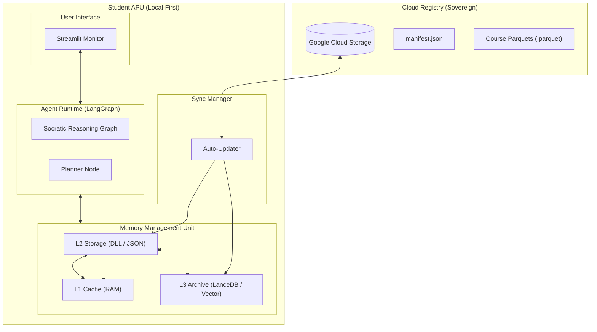

# 🤖 Akili: The Agentic Processor for Education (APU)

**Akili** is a high-performance, local-first pedagogical agent designed as an **Agentic Processor Unit (APU)**. It moves beyond simple RAG by implementing a multi-tier memory hierarchy (L1-L3) and a Socratic tutoring engine, ensuring that students learn through guided discovery rather than just receiving answers.

---

## 🗺️ APU System Architecture



---

## 🧠 Core Technologies

### 1. **Tiered Memory Hierarchy (DLL)**
Akili uses a **Dynamic Learning Layer (DLL)** to manage student context with zero latency:
*   **L1 Cache (RAM)**: In-process memory blocks for immediate reasoning (~0ms).
*   **L2 Storage (DLL)**: Persistent student profile and learning preferences stored locally.
*   **L3 Archive (LanceDB)**: High-speed local vector database for large-scale course materials and past session archival.

### 2. **Socratic Tutoring Engine**
Powered by **Google Gemini**, Akili follows a strict pedagogical framework:
*   **Guided Discovery**: Never gives the answer directly; uses questions to lead the student.
*   **Analogy Injection**: Dynamically adapts explanations based on student interests (e.g., sports, music) retrieved from L2 memory.
*   **Contextual Awareness**: Merges real-time course search with long-term student history.

### 3. **Cloud-Native Registry**
*   **Manifest-driven**: The client synchronizes only what it needs based on a central `manifest.json`.
*   **Parquet Distribution**: Courses are packaged as high-performance Parquet files for efficient local vectorization.
*   **Remote Prompts**: System instructions can be updated globally via the registry without updating the client code.

---

## 📁 Project Structure

```text
/cloud_registry     # Centralized content management & distribution
  ├── courses/      # Raw MD curriculum & prompts
  ├── pipeline/     # Batch processing & GCS upload scripts
  └── registry/     # Generated manifest & parquet files
/app_local          # Local-first student application
  ├── core/         # APU logic (Block Detector, Scheduler)
  ├── mmu/          # Memory Management (L1 Cache, DLL Controller)
  ├── runtime/      # Agent Graph (LangGraph)
  ├── storage/      # Local Database (LanceDB)
  └── ui/           # Streamlit Dashboard
```

---

## 🚀 Getting Started

### 1. Installation
```bash
uv sync
```

### 2. Configure Environment
Create a `.env` file based on `.env.example`:
```env
GEMINI_API_KEY=your_key
GCS_BUCKET_NAME=your_bucket
GOOGLE_APPLICATION_CREDENTIALS=path/to/creds.json
```

### 3. Populate the Registry (Cloud Side)
Before the student can learn, you must process the curriculum and upload it to your cloud storage:
```bash
# Processes all subjects in cloud_registry/config/curriculum.yaml
uv run python cloud_registry/pipeline/batch_pipeline.py --upload
```

### 4. Launch Student Dashboard
```bash
uv run python app_local/main.py
```

---

## 🧪 Advanced Features

### **The "Memory Recall" Demo**
1.  **Sync**: In the dashboard, click "Check for Updates" to download the registry.
2.  **Identity**: Tell Akili: *"My name is Marc and I love basketball."*
3.  **L1 Cache**: Watch the **L1 Cache** update instantly in the dashboard monitor.
4.  **L2 Persistence**: Restart the app; the **L2 Storage** persists your profile.
5.  **Pedagogy**: Ask about a historical event. Akili will explain it using a basketball analogy based on your stored profile.

---
*Built for the future of personalized, autonomous education.*