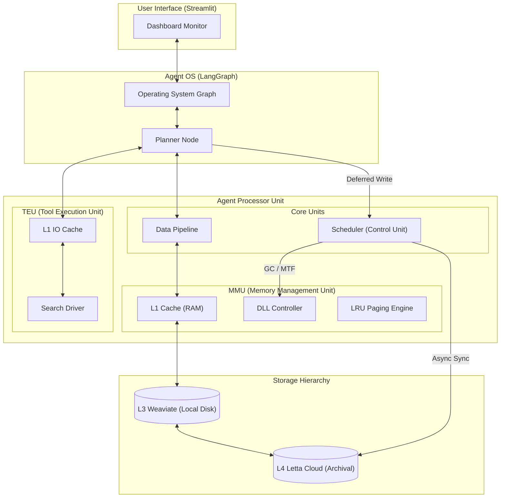

# Agent OS : The APU Architecture 🧠⚡

Welcome to the **Agent Processor Unit (APU)**, a state-of-the-art architecture for building high-performance, resilient, and human-controllable AI agents. 

This project moves away from simple RAG pipelines to implement a full **Semantic Operating System** mimicking hardware-level memory management and task scheduling.

---

## 🗺️ APU System Overview



---

## 🏗️ The APU Micro-Architecture

The system is organized into specialized units, just like a physical CPU:

### 1. **Scheduler (Control Unit)**
The `apu/core/scheduler.py` is the heart of the system. It manages an asynchronous **Priority Queue** to decouple user interaction from slow background tasks.
*   **Deferred Writes**: Memory updates to Letta Cloud (L4) are offloaded to background workers.
*   **Auto-Retry**: Failed cloud syncs are retried up to 3 times with exponential backoff.
*   **Background GC**: Memory reordering (MTF) is handled as a "Garbage Collection" task during idle cycles.

### 2. **Semantic MMU (Memory Management Unit)**
The `apu/mmu/` manages the **Tiered Memory Hierarchy** to ensure sub-millisecond context retrieval:
*   **L1 Cache (RAM)**: In-process memory (~0ms).
*   **L3 Weaviate (Disk)**: Predictable O(1) retrieval via deterministic UUIDs (~10ms).
*   **L4 Letta (Cloud)**: Long-term archival and backup.
*   **LRU Paging**: Automatically ejects least recently used blocks when the context window is full (12 blocks limit).
*   **Page Fault Handling**: Automatically "Pages In" relevant blocks from L3/L4 back to L1 if they are needed by the conversation.

### 3. **TEU (Tool Execution Unit / IO Controller)**
The `apu/teu/` manages external interactions (Google Search, APIs):
*   **L1 IO Cache**: Results from external tools are cached (15 min TTL) to avoid redundant and expensive API calls.
*   **Managed Execution**: Tools are executed in isolation with performance monitoring.

### 4. **Inference Engine (ALU)**
The `agent_os/graph.py` uses Gemini (Flash Lite) as the main logic unit, processing the **Working Context** compiled by the MMU.

---

## 📁 New Project Structure

```text
/apu
  ├── core/         # The "Brain" (Scheduler, Pipeline, Block Detector)
  ├── mmu/          # Memory Management (Controller, Cache L1, Block Factory)
  ├── teu/          # IO Controller (Tool execution, L1 IO Cache)
  └── storage/      # Drivers (Letta, Weaviate, Schema)
/agent_os           # High-level Operating System Graph (LangGraph)
/dashboard          # Streamlit UI / APU Monitor
/research           # Hardware design & Architecture MDs
```

---

## 🚀 Getting Started

### 1. Installation
```bash
uv sync
```

### 2. Configure APU
Follow the `.env.example` to set your Gemini, Letta, and Weaviate keys.

### 3. Initialize Drivers (Hardware Init)
```bash
uv run apu/storage/schema.py            # Init L3 Schema
uv run apu/storage/letta_driver.py --create-agent  # Provision L4 Agent
uv run apu/storage/sync_util.py         # Warm up the L3 Index
```

### 4. Power On
```bash
uv run streamlit run dashboard/app.py
```

---

## 🧪 Advanced Scenarios

### **The "Page Fault" Test**
1.  Fill the memory with 12 dynamic blocks.
2.  Create a 13th block: Watch the MMU **Page Out** the oldest block (LRU) in the logs.
3.  Ask a question about the "paged out" block: Watch the MMU trigger a **Page Fault** and automatically reload it from Weaviate back into the DLL.

### **The "Letta-as-a-Disk" Sync**
1.  Ask a question that updates a block.
2.  The Agent responds **instantly** (Hit L1/L3).
3.  Observe the terminal: The Scheduler pushes a `SYNC_LETTA` task and executes it in the background while you are already reading the answer.

---

## 🚀 Scaling to Production
The APU is designed to be **Distributed-Ready**. By replacing the `metadata_links.json` with **Redis**, you can run millions of APU instances in a cluster, sharing a high-speed L1/L3 context while maintaining a consistent L4 Cloud state.

---
*Built with ❤️ by Ezekias for the next generation of Agentic Systems.*