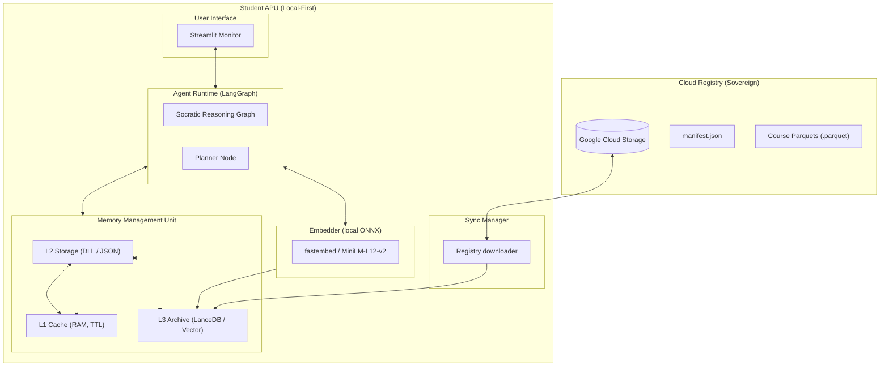

# 🤖 Akili: The Agentic Processor for Education (APU)

**Akili** is a local-first pedagogical agent designed as an **Agentic Processor Unit
(APU)**. It moves beyond simple RAG by implementing a multi-tier memory hierarchy
(L1–L3) and a Socratic tutoring engine, so that students learn through guided
discovery rather than just receiving answers.

The deployment target is constrained hardware such as refurbished laptops, mini-PCs,
Raspberry Pi class with intermittent or absent connectivity. Bounded RAM,
bounded storage growth and no unnecessary network round trip on the read path are
product requirements, not preferences.

**Designing for the floor, not the ceiling.** Everything here is built to run
where resources are scarce. A system that holds up under those conditions also
holds up with more headroom, the reverse is not true, which is why the
constraint is the starting point rather than an afterthought. That is also why
`llm_provider.py` ships several LLM connectors and the embedder is swappable: the
same codebase should serve a classroom Raspberry Pi and a well-provisioned
server, differing only by configuration.

---

## 🖥️ The APU Control Center


The dashboard is not a demo skin: it is the memory hierarchy, visible while it
works. On the left, **L1** shows which blocks are hot in RAM and their hit rate.
Below it, **L2** shows the DLL chain with each block's type, such as `TEMP`,
`COURS`, `FONDAMENTAL`, which is what drives its TTL and its recall threshold.
On the right, the tutor.

---

## 💬 A real session

Grace, first time opening the app. Nothing has been typed about her before.

> **Grace** — Hello, my name is Grace. What can you teach me?
>
> **Akili** — Hi Grace! It's wonderful to meet you. I'm Akili, and I'm here to
> help you master your 6eme math!
>
> Since we are currently working on **fractions**, we can explore what a fraction
> actually represents, how to compare different fractions, or how to use them in
> real-life situations.
>
> To get us started, how do you feel about fractions so far?

Akili was never told the topic. *"Currently working on fractions"* comes from the
`current_session` block in L2; the name comes from `student_profile`. That is the
memory hierarchy feeding the prompt.

> **Grace** — I don't know anything about fractions, it is my first time to learn
>
> **Akili** — Don't worry at all — everyone starts from the very beginning.
>
> Think of a fraction as just a way to talk about parts of a whole. Imagine you
> have a pizza. If you cut that pizza into 4 equal slices, and you take 1 slice,
> you have taken a "fraction" of the pizza.
>
> Before we look at the actual numbers, does the idea of "parts of a whole" make
> sense to you?

The pizza is not the model improvising. `chapter_1_simple_fractions.md` reads:
*"Imagine a pizza cut into 4 equal slices. If you eat 1 slice, you have eaten 1/4
of the pizza."* That chapter was retrieved from L3 and injected into the prompt —
this is the RAG path, visible in the wording.

> **Grace** — oh yes, it makes sense for me
>
> **Akili** — To make sure we've really got the hang of it, let's try a quick
> challenge. Imagine a chocolate bar divided into 8 equal pieces. If you give 3
> pieces to a friend, how would you write that as a fraction?

The chocolate bar is *not* in the course. The model kept the pedagogical shape of
the chapter and built a new exercise from it — grounded without reciting. And it
asks rather than answers: the Socratic constraint, which held for every turn of
this session.

---

## 🗺️ APU System Architecture


```mermaid
graph TD
    subgraph CLOUD ["Cloud Registry (Sovereign)"]
        GCS[("Google Cloud Storage")]
        Manifest["manifest.json"]
        Parquets["Course Parquets (.parquet)"]
    end

    subgraph CLIENT ["Student APU (Local-First)"]
        direction TB

        subgraph UI ["User Interface"]
            Dashboard["Streamlit Monitor"]
        end

        subgraph OS ["Agent Runtime (LangGraph)"]
            Graph["Socratic Reasoning Graph"]
            Planner["Planner Node"]
        end

        subgraph EMB ["Embedder (local ONNX)"]
            Onnx["fastembed / MiniLM-L12-v2"]
        end

        subgraph MMU ["Memory Management Unit"]
            L1["L1 Cache (RAM, TTL)"]
            L2["L2 Storage (DLL / JSON)"]
            L3["L3 Archive (LanceDB / Vector)"]
        end

        subgraph SYNC ["Sync Manager"]
            Sync["Registry downloader"]
        end
    end

    %% Connections
    GCS <--> Sync
    Sync --> L3

    Dashboard <--> OS
    OS <--> EMB
    OS <--> MMU
    EMB --> L3
    MMU <--> L1
    MMU <--> L2
    MMU <--> L3
    L1 <--> L2
```

> The sync manager writes the `edu_registry` table (L3), `local_manifest.json` and
> `prompts.json`. It does not write the DLL (L2) — there is no `Sync --> L2` edge.

---

## 🧠 Core Technologies

### 1. Tiered memory hierarchy

**DLL** here means **doubly linked list** — the ordered chain of memory blocks the
BMJ routing algorithm reorders. (Earlier revisions of this document expanded it as
"Dynamic Learning Layer"; the code has always meant the data structure.)

*   **L1 Cache (RAM)**: in-process block content for immediate reasoning (~0 ms),
    with per-type TTLs.
*   **L2 Storage (DLL)**: the block chain and its `prev`/`next` pointers, plus node
    content, persisted to `metadata_links.json`. Survives a restart.
*   **L3 Archive (LanceDB)**: local vector store for course material and archived
    session memory. Queried on every turn without a network round trip.

### 2. Local embeddings — no network on the read path

Query and document vectors are produced on-device by
`sentence-transformers/paraphrase-multilingual-MiniLM-L12-v2` (384 dimensions,
multilingual) running under **fastembed / ONNX Runtime**. There is no PyTorch and
no `sentence-transformers` dependency: both are disqualifying on the target
hardware.

Measured on the development machine: **~2.4 ms per query embedding** (1.6 ms
batched), against hundreds of milliseconds for a remote embedding call — and it
works with no connectivity at all.

### 3. Socratic tutoring engine

**Inference is the only pluggable component, and the only one that may need the
network.** Everything else — embeddings, retrieval, L1/L2/L3 memory — is local,
always. Swap the LLM backend and nothing else in the system changes:

| `LLM_PROVIDER` | Model | Where inference runs | Whole system offline? |
|---|---|---|---|
| `ollama` (local host) | e.g. `gemma:2b` | on the device | **yes — 100% offline** |
| `ollama` (remote host) | e.g. `gemma:2b` | a machine you run | no — LLM only |
| `gemma` | `gemma-4-26b-a4b-it` (Google AI Studio) | third-party API | no — LLM only |
| `gemini` | `gemini-flash-lite-latest` | third-party API | no — LLM only |
| `openrouter` | configurable | third-party API | no — LLM only |

`gemma-4-26b-a4b-it` via Google AI Studio is the model this project is developed
and demonstrated against.

That is the design claim worth understanding: reaching a fully offline
deployment is a matter of pointing `LLM_PROVIDER` at a locally hosted model, not
of rewriting anything. Note that `ollama` does **not** imply local — pointing
`OLLAMA_BASE_URL` at another machine is a common setup when the device is too
small to host a model, and is what the project is developed against.

Whichever provider is selected, Akili follows the same pedagogical framework:

*   **Guided discovery**: leads with questions rather than answers.
*   **Analogy injection**: adapts explanations to student interests held in L2.
*   **Contextual awareness**: merges local course retrieval with student history.

### 4. Cloud-native registry

*   **Manifest-driven**: the client downloads only the courses it needs.
*   **Parquet distribution**: courses ship as pre-vectorised Parquet files.
*   **Remote prompts**: system instructions can be updated without a client release.

---

## 🔧 The embedding model is a deployment parameter

**It is not an architectural constant.** `paraphrase-multilingual-MiniLM-L12-v2` is
the default because the target is constrained hardware. A deployment with more
headroom can configure a stronger multilingual embedder, at the cost of a larger
on-disk footprint, higher per-embedding latency, and a wider vector.

It is configured in **`embedding_config.py` at the repo root** — one module read
by both the client and the cloud pipeline. That single source is the whole point:
when the pipeline had its own hardcoded model id, setting `EMBEDDING_PROVIDER`
changed the client and left the registry being published in a different vector
space, with nothing reporting it.

Overridable by environment:

| Setting | Default | Meaning |
|---|---|---|
| `EMBEDDING_PROVIDER` | `local` | `local` (ONNX, offline) or `google` (remote) |
| `EMBEDDING_MODEL` | `sentence-transformers/paraphrase-multilingual-MiniLM-L12-v2` | model id |
| `EMBEDDING_DIM` | `384` | vector width — must match the model |
| `EMBEDDING_CACHE_DIR` | `./models` | where the ONNX files live on device |

> **Changing any of these requires regenerating the cloud registry and re-running
> the local migration on every device.** Query vectors and document vectors must
> come from the same model — a mismatch does not fail on its own, it returns
> noise ranked as though it were relevant.

Two steps, in this order:

```bash
# 1. cloud side — republish the registry in the new vector space
uv run python cloud_registry/pipeline/batch_pipeline.py --upload

# 2. every device — re-embed local memory from its stored content, offline
uv run python scripts/migrate_embeddings.py --apply
```

Any course already downloaded on a device must be re-fetched.

**You are not expected to remember this.** The model id and dimension are stamped
into the registry manifest and into a local sidecar, and `search_block_index`
refuses to search on a mismatch with a message naming both models:

```
Table 'edu_registry' holds 3072-dimension vectors but the configured embedder
'sentence-transformers/paraphrase-multilingual-MiniLM-L12-v2' produces 384.
These are different vector spaces; searching would return noise ranked as
though it were relevant.
```

The dimension check reads the Arrow schema, so it works even on a store written
before stamping existed. The model check uses the sidecar, and catches the
harder case of two different models that happen to share a width.

---

## 📁 Project Structure

```text
/cloud_registry     # Centralized content management & distribution
  ├── courses/      # Raw MD curriculum & prompts
  ├── pipeline/     # Batch processing & GCS upload scripts
  └── registry/     # Generated manifest & parquet files
/app_local          # Local-first student application
  ├── core/         # APU logic (Block Detector, Scheduler)
  ├── mmu/          # Memory Management (L1 Cache, DLL Controller)
  ├── runtime/      # Agent Graph (LangGraph)
  ├── storage/      # Local Database (LanceDB)
  └── ui/           # Streamlit Dashboard
/scripts            # One-off operational tooling (see below)
/tests              # pytest suite — runs offline, with no API key
/models             # Bundled ONNX embedding model (not in git)
```

---

## 🚀 Getting Started

### 1. Installation

```bash
uv sync
```

### 2. Fetch the embedding model — on a connected machine

The agent never downloads the model at runtime: on a machine with no connectivity
that would hang at the first student question instead of failing. Populate the
cache once, then ship it with the deployment.

```bash
uv run python scripts/fetch_embedding_model.py
```

This writes ~240 MB into `./models`. Copy that directory onto each target device.
If it is missing at startup the agent fails immediately with instructions rather
than hanging.

### 3. Configure environment

Embeddings and retrieval are local and need no configuration — the defaults in
`app_local/config/settings.py` are already correct. The only thing you actually
choose is **where inference runs**.

**Option A — fully offline.** Requires a device that can host the model:

```env
LLM_PROVIDER=ollama
OLLAMA_MODEL=gemma:2b
OLLAMA_BASE_URL=http://localhost:11434
```

```bash
ollama pull gemma:2b
```

**Option B — Ollama on another machine.** Same engine, hosted elsewhere, for
devices too small to run a model. Only the LLM leaves the device:

```env
LLM_PROVIDER=ollama
OLLAMA_MODEL=gemma:2b
OLLAMA_BASE_URL=http://<your-ollama-host>:11434
```

**Option C — a hosted API.** Every student message goes to the provider. This is
the configuration the project is developed against:

```env
LLM_PROVIDER=gemma
GEMMA_MODEL=gemma-4-26b-a4b-it
GEMINI_API_KEY=your_key      # a Google AI Studio key: aistudio.google.com/app/apikey
```

Other hosted backends use the same key or their own:

```env
LLM_PROVIDER=gemini          # gemini-flash-lite-latest, same AI Studio key
LLM_PROVIDER=openrouter      # needs OPENROUTER_API_KEY
```

In all three cases embeddings, retrieval and memory stay on the device. Moving
between them is a config change, nothing more.

#### Downloading courses (optional)

Reading the course registry from Cloud Storage is a separate concern from the
LLM, and is only needed when you actually fetch a course. Either authenticate
with Application Default Credentials:

```bash
gcloud auth application-default login
```


### 4. Populate the registry (cloud side)

```bash
uv run python cloud_registry/pipeline/batch_pipeline.py --upload
```

### 5. Launch the student dashboard

```bash
uv run python app_local/main.py
```

---

## 🛠️ Operational scripts

These are run by hand, never by the app.

| Script | Purpose |
|---|---|
| `scripts/fetch_embedding_model.py` | Populate the ONNX model cache before deployment. |
| `scripts/dedup_user_memory.py` | Compact a `user_memory` table written before writes became real upserts. Dry-run by default; `--apply` to rewrite, backup taken first. |
| `scripts/migrate_embeddings.py` | Re-embed local memory after an embedding-model change. Works offline — rows keep their `content`. Dry-run by default; `--apply` to rewrite, backup taken first. |

---

## 🧪 Tests

```bash
uv run pytest
```

The suite runs with **no API key and no network access**. Embeddings are stubbed or
injected; LanceDB and the DLL metadata file are redirected to temporary paths, so
the suite never touches `app_local/storage/` or `app_local/memory/`.

---

## ⚠️ Known state

This section reflects what the code does today, so that nothing here has to be
taken on trust.

* **Course retrieval works.** Until recently `search_block_index` returned nothing
  on every call, so no curriculum ever reached the prompt. Fixed.
* **The registry must be republished.** Parquet files uploaded before this
  migration were embedded at 3072 dimensions by a remote embedder.
  Regenerate with `batch_pipeline.py --upload`, and re-fetch any course already
  downloaded to a device. A device that skips this gets a readable refusal, not
  bad answers — but it gets no course retrieval until it does.
* **"Check for Updates" is unreliable.** `sync_with_registry` raises
  `UnboundLocalError` on several paths, including the steady state where
  everything is already up to date. Fix pending.
* **A bad `LLM_PROVIDER` fails at import, not at the first question.**
  `llm_provider.py` raises on an unrecognised value, and `agent.py` builds both
  LLMs at module scope — so a typo in `.env` stops the app from starting rather
  than producing a confusing turn. Loud, but earlier than ideal; making the
  construction lazy is pending.
* **Inference is the only network dependency left.** Retrieval and memory work
  with sockets blocked; a turn fails only at generation, and only when the
  configured LLM is remote. Pinned by
  `test_generation_is_the_only_remaining_network_dependency`.
* **There is no degraded answer when the LLM is unreachable.** With a remote
  provider and no connectivity the turn raises rather than serving a memory-only
  reply. A local `LLM_PROVIDER` removes the problem entirely.

---
*Built for the future of personalized, autonomous education.*
