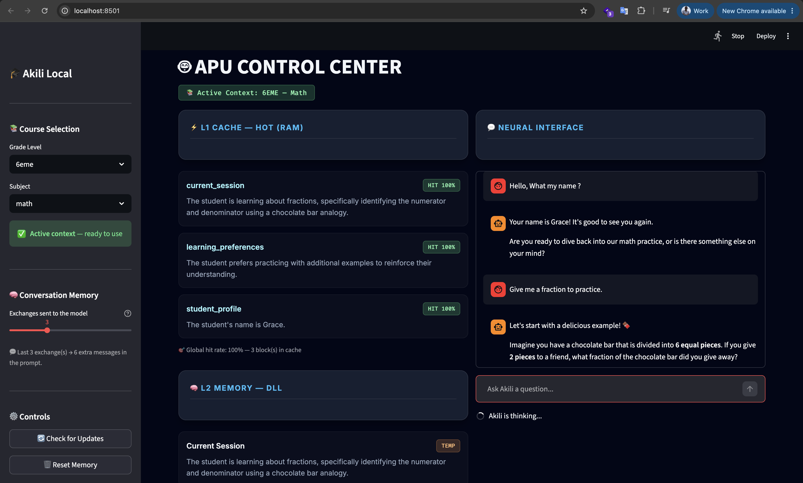
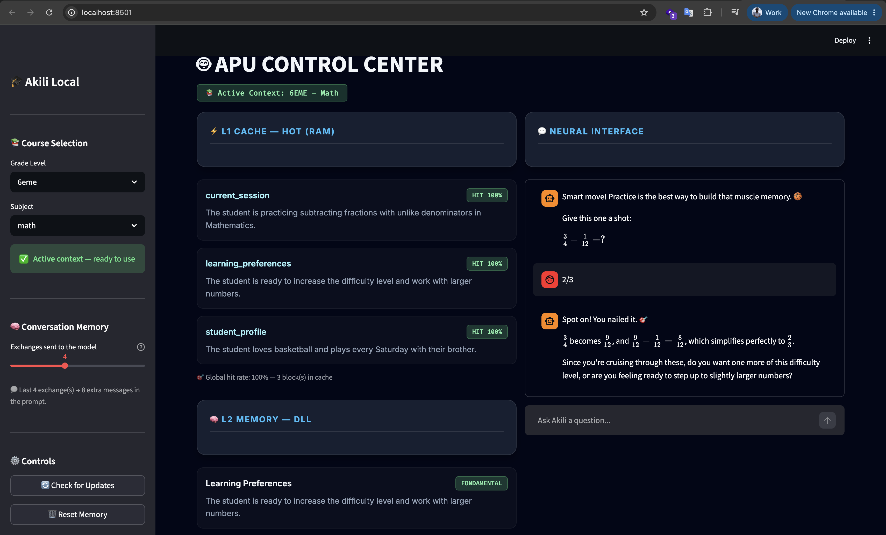
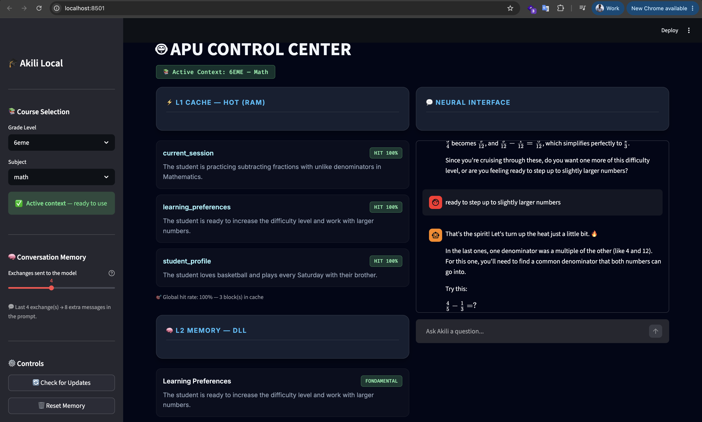
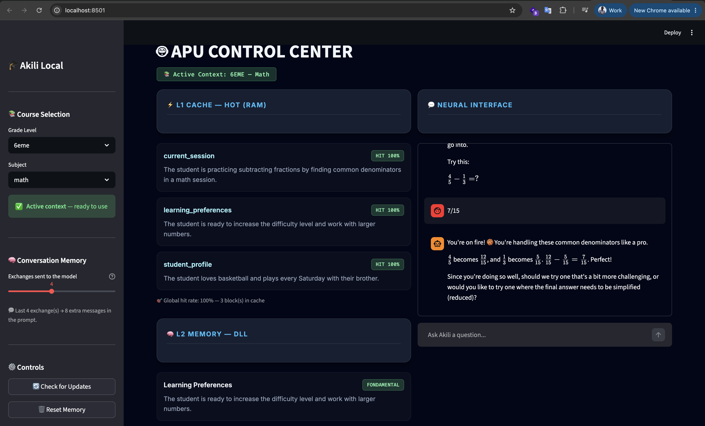
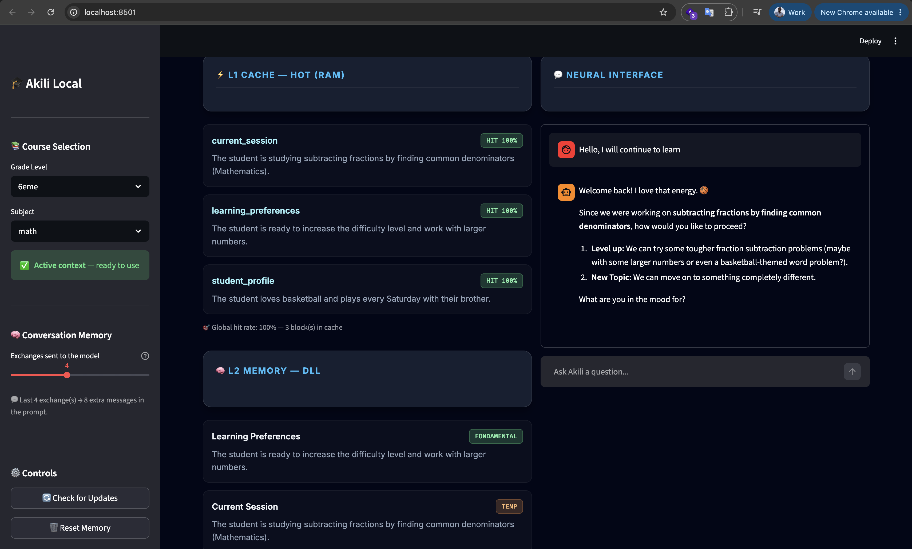

# A session in five screenshots

The same tutoring session the root README quotes, seen from the APU Control
Center. Left column: L1 cache and the L2 DLL. Right column: the student's view.
Read top to bottom — the memory blocks change from one screen to the next, and
that is the whole point.

---

## 1 — Reopening the app

Grace asks *"Hello, What my name?"* and gets *"Your name is Grace! It's good to
see you again."*

Nothing in the conversation says her name — the app was just reopened. The answer
comes from the `student_profile` block, sitting in L1 at `HIT 100%` alongside
`learning_preferences` and `current_session`. The session block reads: *learning
about fractions, specifically identifying the numerator and denominator using a
chocolate bar analogy.*

The sidebar shows the conversation window at `3`: *"Last 3 exchange(s) → 6 extra
messages in the prompt."*

---

## 2 — Memory that holds a teaching state

`3/4 − 1/12 = 2/3`, answered and confirmed.

Look at the left column rather than the answer. `learning_preferences` now reads
*"The student is ready to increase the difficulty level and work with larger
numbers"* — that is not a fact about Grace, it is a judgement about where she is
in the material, written by the extractor and kept in L2.

`student_profile` reads *"The student loves basketball and plays every Saturday
with their brother"*, which is where the 🏀 in the tutor's reply comes from.

The window is at `4` here: *8 extra messages in the prompt*.

---

## 3 — The turn that needs the transcript

> *"In the last ones, one denominator was a multiple of the other (like 4 and 12).
> For this one, you'll need to find a common denominator that both numbers can go
> into."*

To write that sentence the tutor has to look back at the exercises it set and
extract what they had in common. 4→12, 4→8 and 3→6 all scale a single fraction;
5 and 3 force both to move. No block in L1 or L2 contains that — it comes from the
conversation window, and at `0` exchanges this turn is not possible.

---

## 4 — The session block sharpening

`4/5 − 1/3 = 7/15`, correct, and it does not reduce.

`current_session` has moved again: from *subtracting fractions with unlike
denominators* to *subtracting fractions by finding common denominators*. Across
the four screens that block goes chocolate bar → unlike denominators → common
denominators, following the lesson as it narrows.

The closing question offers *"one where the final answer needs to be simplified"* —
simplification went unused on this exercise, and the tutor proposes to come back
to it.

---

## 5 — Closing the app, and reopening it

> **Grace** — Hello, I will continue to learn
>
> **Akili** — Welcome back! I love that energy. 🏀
>
> Since we were working on **subtracting fractions by finding common
> denominators**, how would you like to proceed?
>
> 1. **Level up:** tougher fraction subtraction problems (maybe with larger
>    numbers, or even a basketball-themed word problem?)
> 2. **New Topic:** something completely different.

The process was restarted, so the transcript is empty — the exchange above is the
whole conversation. Every specific in that greeting is read back from the three
blocks on the left:

- *"subtracting fractions by finding common denominators"* — `current_session`,
  word for word
- the 🏀 and the *basketball-themed word problem* — `student_profile`
- *"Level up… larger numbers"* — `learning_preferences`

The sidebar still shows the conversation window set to `4`. That caption is
computed from the slider alone, not from what exists: with no transcript to draw
from, the setting changes nothing here. Continuity on this screen is carried
entirely by L1 and L2.

Which is the point of the whole series. Screens 1–4 show the window doing work no
memory block can do — knowing which exercise is open. This one shows the memory
hierarchy doing work no window can do — surviving the process that produced it.

---

*The wide overview shot in the root README is [alu-education-agent.png](alu-education-agent.png).*
